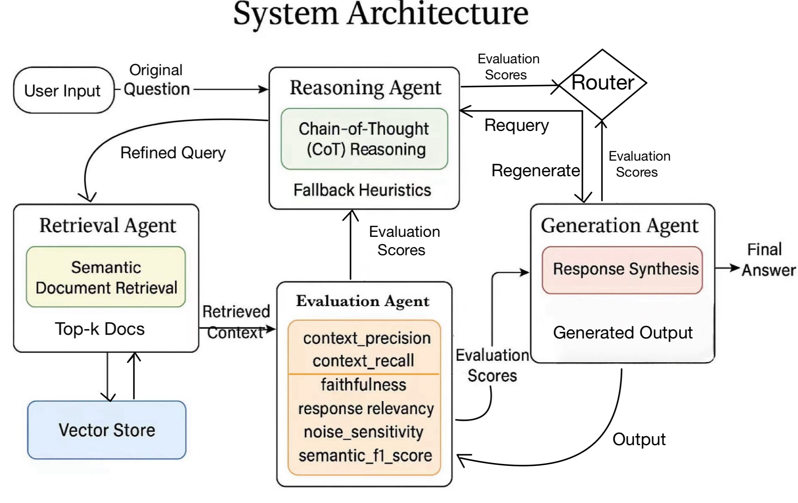

# Agentic-RAG: A Multi-Agent Retrieval-Augmented Generation Pipeline

This project implements an **Agentic Retrieval-Augmented Generation (RAG)** system for question answering, designed to overcome the limitations of traditional RAG pipelines such as hallucinations, poor retrieval quality, and lack of adaptive control.

## 🔧 System Architecture

The system follows a **multi-agent modular architecture**, with four core agents operating in a dynamic evaluation-feedback loop:

- **Reasoning Agent:** Reformulates vague or under-specified questions using DSPy + MIPROv2, generating semantically rich queries.
- **Retrieval Agent:** Uses LangChain and FAISS to fetch top-K relevant documents based on dense embeddings.
- **Evaluation Agent:** Computes faithfulness, relevancy, noise sensitivity, semantic F1, context precision, and recall.
- **Generation Agent:** Produces final answers via prompt templates, with retry logic based on evaluation metrics.
- **Router:** Directs the flow of execution based on metric thresholds or fallback strategies (e.g., hybrid rules).

 <!-- Replace with your actual diagram if uploaded -->

## 🚀 Features

- Multi-agent architecture with specialized roles
- Metric-aware routing for dynamic execution control
- Retry loops for both retrieval and generation stages
- Evaluation pipeline with five detailed metrics
- Semantic F1 scoring via DSPy integration

## 📁 Project Structure

- `agents/` — Reasoning, Retrieval, Evaluation, and Generation agent code
- `scripts/` — Data preprocessing and vectorstore building
  - `build_hotpot_mini.py` — Build a test subset of HotpotQA
  - `build_vectorstore.py` — Generate dense vectors and FAISS index
- `main-hotpot.py` — Main execution pipeline
- `requirements.txt` — Python dependencies
- `README.md` — This file
- `assets/` — System diagrams and figures for the README


---

## 🧪 Running the Pipeline

### Step 1: Install Dependencies

```bash
pip install -r requirements.txt
```

### Step 2: Build the Vectorstore

```bash
# Build a subset of HotpotQA (optional)
python scripts/build_hotpot_mini.py

# Generate vectorstore using FAISS
python scripts/build_vectorstore.py
```

### Step 3: Run the Pipeline

```bash
python main-hotpot.py
```


## 📊 Evaluation Metrics

The pipeline includes five key metrics:

| Metric                     | Description                                       |
| -------------------------- | ------------------------------------------------- |
| Faithfulness               | Whether the answer is supported by retrieved docs |
| Response Relevancy         | Semantic similarity between question and answer   |
| Noise Sensitivity          | Degree of distraction from irrelevant context     |
| Semantic F1 Score          | DSPy-based semantic overlap with ground-truth     |
| Context Precision / Recall | Relevance and completeness of retrieved passages  |

A test case is marked Pass if it satisfies the hybrid rule:

(Faithfulness ≥ 0.7, Relevancy ≥ 0.7, Noise ≤ 0.4, Semantic F1 ≥ 0.7)
OR

(Semantic F1 ≥ 0.75 and Context Recall ≥ 0.7)


## 📈 Results
The system achieved:

Average Faithfulness: 0.73

Semantic F1 Score: 0.89

Overall Accuracy: 80% on 10 HotpotQA cases


## 📬 Acknowledgments
This project was developed as part of an Independent Study at UC Santa Cruz. Special thanks to faculty advisors and reviewers for their guidance.